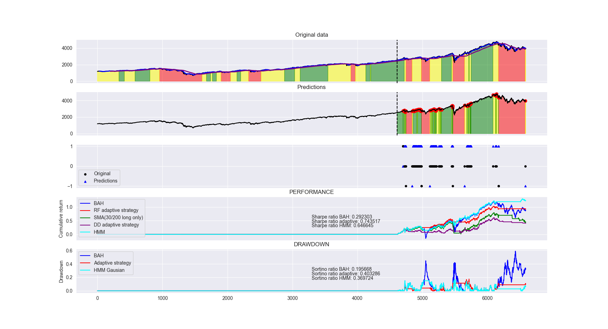

# Random Forest vs. HMM vs. Naive

## Introduction
This repo aims to detect potential market regimes. In particular, it compares the detection capability of a Random Forest Model vs. Gausian Hidden Markov Model. Both are fed with a bunch of economic and financial indicators (see subsequently).

## Indicators / Features

### Daily
- OFR Financial Stress Index (https://www.financialresearch.gov/financial-stress-index/)
- T10Y2Y Spread (https://fred.stlouisfed.org/series/T10Y2Y)
- T103M Spread (https://fred.stlouisfed.org/series/T10Y3M)
- Wilshire 5000 Index (https://fred.stlouisfed.org/series/WILL5000PRFC)

### Weekly
- AAII Sentiment Survey (https://www.aaii.com/sentimentsurvey/sent_results)

### Monthly
- IFO Geschäftsklimaindex / IFO business climate index (German) (https://www.ifo.de/ifo-zeitreihen)
- US Unemployment rate (https://fred.stlouisfed.org/series/UNRATE)
- US Consumer sentiment (https://fred.stlouisfed.org/series/UMCSENT)

### Quarterly
- US GDP (https://fred.stlouisfed.org/series/GDP)
- EU GDP (https://fred.stlouisfed.org/series/CPMNACSCAB1GQEU272020)
- "Buffet Indicator": ratio of United States stock market (represented by Wilshire 5000) to GDP 

> Indicators not available on a daily basis were updated linearly until a new data point was available.

### Engineered / Synthetic Features
- Date-Related Features (Day of week/Month/Quarter/)
- Lags of daily indicators
- Rolling Weighted average, Max, Min and StdDev of each daily Feature

## Summary in a Nutshell
- First and foremost, there are **no transaction costs**.
- The forecast is for the next two days, as data for indicators may be published with a delay.
- The meaning of market lights is as follows:
    - Green: 100% risky assets (stocks)
    - Yellow: 60% stocks/40% bonds
    - Red: Risk-free rate (assumed to be 0%)
- Samples: 6591, Features: 173
- A plain vanilla Random Forest was implemented using 70% of the data for training, 100 trees, and **no cross-validation or grid-search**.
- The *market_light* is derived from the drawdown on a fictive Buy and Hold strategy:
    - If drawdown is greater than 0, market_light is equal to 1 (green).
    - If drawdown is between -0.02 and 0, market_light is equal to 0 (yellow).
    - If drawdown is less than or equal to -0.05, market_light is equal to -1 (red, crisis).
- A Gaussian Hidden Markov Model (GHMM) was implemented with three components.
- Neither the "raw" predictions of the Random Forest nor the GHMM were used. Median filtering was applied to smoothen out the market data in order to reduce noise.
- Naive benchmark strategies were implemented, including:
    - Buy and Hold
    - SMA 30/200 crossover long-only filter
    - Drawdown-adaptive strategy (involving refraining from investing on the next day if the drawdown on day t falls below -0.05. If the drawdown falls below -0.02, the allocation is adjusted to 60% in stocks and 40% in bonds.)
- The GHMM outperformed all other strategies in terms of performance.
- The Random Forest outperformed the naive strategies, but performed a little more worse than the simple Buy and Hold strategy.
- The drawdown of the GHMM was significantly lower than that of the Random Forest strategy.

